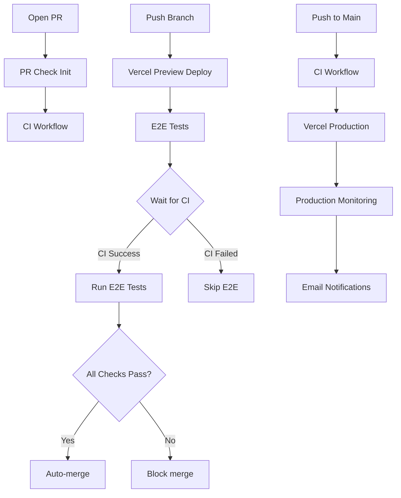

# Updated Workflow Files Summary

## 📁 File Overview

### **Main Workflows**

| File                        | Purpose                                   | Triggers                | GitHub Checks                  |
| --------------------------- | ----------------------------------------- | ----------------------- | ------------------------------ |
| `ci.yml`                    | Code quality checks (lint, test, build)   | PR events, push to main | ✅ "CI Checks"                 |
| `preview-e2e-tests.yml`     | End-to-end testing on preview deployments | Vercel webhook          | ✅ "E2E Tests (browser)"       |
| `production-monitoring.yml` | Health checks for production deployments  | Vercel webhook          | ❌ (monitoring only)           |
| `pr-check-init.yml`         | Initialize check runs when PR opens       | PR open/sync            | ✅ Creates all required checks |

### **Custom Actions**

| File                             | Purpose                              | Used By               |
| -------------------------------- | ------------------------------------ | --------------------- |
| `github-check/action.yml`        | Create/update GitHub checks natively | All workflows         |
| `wait-for-deployment/action.yml` | Wait for Vercel deployment readiness | E2E, Production       |
| `send-notifications/action.yml`  | Send email notifications             | Production monitoring |

### **Configuration**

| File           | Purpose                                 |
| -------------- | --------------------------------------- |
| `pipeline.yml` | Central configuration and documentation |
| `MIGRATION.md` | Step-by-step migration guide            |

---

## 🔄 Workflow Flow Diagram



---

## 🎯 Key Features

### **✅ Fixed Issues**

- **Timing**: Checks created at proper time (when PR opens)
- **Coordination**: E2E waits for CI completion
- **GitHub Integration**: Native checks API instead of webhooks
- **Branch Protection**: Works correctly with required checks
- **Auto-merge**: Triggers when all checks pass

### **🚀 New Capabilities**

- **Smart Environment Detection**: CI handles both PR and main contexts
- **Proper Check Naming**: Consistent names for branch protection
- **Workflow Coordination**: E2E intelligently waits for dependencies
- **Native GitHub UI**: All check status visible in PR interface

---

## 📋 Required GitHub Settings

### **Branch Protection Rules (Main Branch)**

```yaml
required_status_checks:
  - "CI Checks"
  - "E2E Tests (chromium)"
  - "E2E Tests (firefox)"
  - "E2E Tests (webkit)"
  - "E2E Tests (mobile-chrome)"
  - "E2E Tests (mobile-safari)"

allow_auto_merge: true
required_approving_review_count: 0
```

### **Repository Settings**

- ✅ Allow auto-merge
- ✅ Automatically delete head branches

---

## 🔧 Environment Variables

### **Required for All Workflows**

```bash
OPENAI_API_KEY
UPSTASH_REDIS_REST_URL
UPSTASH_REDIS_REST_TOKEN
```

### **Required for E2E Tests**

```bash
VERCEL_AUTOMATION_BYPASS_SECRET
```

### **Required for Production Monitoring**

```bash
SMTP_USERNAME
SMTP_PASSWORD
NOTIFICATION_EMAIL
```

### **Optional**

```bash
CODECOV_TOKEN  # For coverage reporting
```

---

## 🎭 Workflow Behaviors

### **CI Workflow**

- **PR Context**: Creates "CI Checks", uploads coverage
- **Main Context**: Creates "CI Checks", skips coverage
- **Always**: Builds artifacts, runs all quality checks

### **E2E Workflow**

- **Filters**: Only preview deployments, not main branch
- **Coordination**: Waits up to 10 minutes for CI completion
- **Matrix**: Runs across 5 browsers in parallel
- **Artifacts**: Uploads test results and HTML reports

### **Production Monitoring**

- **Triggers**: Only production environment deployments
- **Health Checks**: Smoke tests, API health, performance, SSL
- **Notifications**: Success or failure emails with details
- **Artifacts**: Saves test results for debugging

### **PR Check Initialization**

- **Purpose**: Creates check placeholders for branch protection
- **Timing**: Immediately when PR opens
- **Checks**: All 6 required checks (1 CI + 5 E2E browsers)

---

## 🚀 Expected Developer Experience

1. **Push branch** → Vercel deploys preview
2. **Open PR** → All checks appear as "Queued"
3. **CI runs automatically** → Check updates to "In Progress" → "Success/Failed"
4. **E2E runs after CI** → Browser checks update individually
5. **All pass** → Auto-merge becomes available
6. **Merge** → Production deployment + monitoring

The new pipeline provides exactly the flow you wanted with proper GitHub integration!
